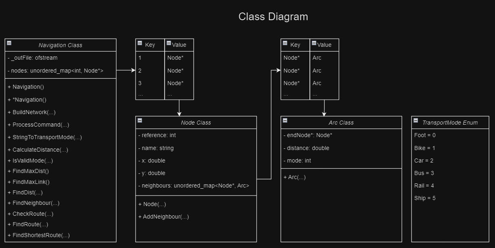
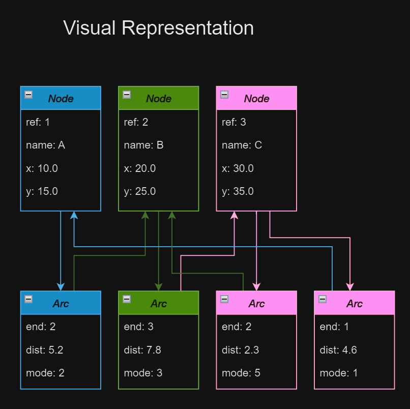

## Advanced Programming - Lab I (Final Lab)
### Question
---

The objective of this final lab is to implement, exercise and assess the performance of data structures that represent a transport network and support route-finding and evaluation.  A network is a collection of nodes and arcs so, in the context of a transport network the nodes will correspond to road/rail junctions; towns/cities/villages; bus/rail stations; air/sea ports, etc., while the network arcs will be road/rail route segments or air corridors/sea lanes as appropriate.

Data will be supplied (in formats as described below) for the nodes and arcs representing a transport network, together with a ‘command’ file specifying operations to be performed on the network data.  These operations may include, for example, reporting the distance between two nodes (places) on the network; finding neighbour nodes to a starting point; finding or validating a node sequence to form a journey between two places (pairs of nodes for origin and destination).  For each command type, a specific output format will be defined.  To streamline the assessment process, your software must implement all input and output formats precisely.

You will construct software in C++ with suitable class definitions for the necessary data structures, to input the supplied data and work through the commands. You will also be expected to present diagnostic data on process efficiency, for example the number of node/arc records visited in the data structure.

Performance is a key aspect of this Lab.  You will be expected not only to create a working solution, but a solution that executes quickly.  The marks allocated to the software are split equally between correctness and performance. 

### Provided Code and Files
Initial code has been provided and this **MUST** be used as a starting point for your implementation.

#### Main.cpp
This file must **NOT** be edited. The `main.cpp` file will be replaced by a different `main.cpp` file during the marking process, along with different data files.  Therefore, any changes you make to your `main.cpp` file will be overwritten. Your software **MUST** work with the provided `main.cpp` file otherwise your code will not compile with the replacement `main.cpp` file.

#### Utility

The `Utility` class contains a function called `LLtoUTM(...)`.  This function has been provided to convert latitude and longitude into x and y global coordinates.  It is recommended that you make use of this function when calculating distances.
Here is some example code (that is also in the `Navigation::BuildNetwork(...)` method) that shows how to use it.

```c++
// example code of using the LLtoUTM function from Utility to convert 
// latitude and longitude values into x and y global coordinates:
double latitude = 53.770, longitude = -0.368, x, y;
Utility::LLtoUTM(latitude, longitude, x, y);
```

#### Commands.txt
The `Commands.txt` file is a file that you may edit.  This is a list of commands that your program is to execute.

#### Navigation class
The provided Navigation class must **NOT** be renamed otherwise the replaced `main.cpp` file will not be able to find it.  You may, however, change the way the method parameters are passed (to satisfy Parasoft rules) but you must not change the type (i.e. string) – to reiterate **DO NOT** change any code inside of main.cpp.  Do **NOT** output to the ‘cout’ apart from at the end of your code.

The `BuildNetwork(...)` method will be used to:
1. Read in the network definition data (Places and Links files)
2. Construct your internal data structure(s). This method **MUST** return `true` if the build is successful (e.g. files have been correctly read) or `false` if the build is unsuccessful.  You **MUST** not change either the name or the parameters of this method.

The `ProcessCommand(...)` method is used to process each navigation command in turn. This method **MUST** return `true` if it processes the command successfully or `false` if it does not process the command successfully.  You **MUST** not change either the name or the parameters of this method.

The output file stream `_outFile` has already been created for you.  You **MUST** use this to output your results.  **DO NOT** change the output filename.

#### Data 
Data is supplied in `csv` format (comma-separated variables) in two files: namely `Places.csv` and `Links.csv`.
Command formats are as described later in this document.

For the network Nodes (Places) file, each line of text will comprise a place name string (which may contain space(s)), followed by three numbers, being an integer reference code and two decimal numbers giving the location as a pair of coordinates for latitude and longitude in that conventional order.
For example, lines of the Places file might read:
```
Cottingham Rail,15931781,53.781,-0.407
Beverley Rail,15761842,53.842,-0.424
```

Data for each Arc (Link) will comprise two reference numbers for the nodes that the Arc joins, followed by a string giving the transport mode of the Arc.
For example, a line of the Links file that describes a Rail link between Cottingham Rail and Beverley Rail might read:
```
15931781,15761842,Rail
```

Transport Modes are Foot, Bike, Car, Bus, Rail, Ship.  When journeys are being investigated, only valid arcs may be considered according to the required mode and the following rules of hierarchy:
1.	a rail or ship journey may only use Arcs of the corresponding mode
2.	a bus journey may use bus, rail and ship Arcs
3.	a car journey may use car, bus and ship Arcs
4.	a bike journey may use bike Arcs and Arcs defined in 1 and 2
5.	a foot journey may use any Arc

These rules recognise for example that roadways generally have footpaths alongside (for the purposes of this exercise, motorways are excluded), and foot passengers may board all public transport modes.

---

#### Data Structures
You must define suitable C++ classes to hold the network data, preferably using dynamic data structure techniques to build a single structure which will allow processes to follow Arcs (route segments) in sequence from a starting location towards and ultimately reaching a destination (see example diagram in fig 1).

The location data may be held in a linked list or an array of Node objects, with a suitable access mechanism so Nodes can be accessed according to their reference number.
Nodes should also allow for their name and their coordinates to be retrieved (their coordinates are provided as longitude and latitude, but you may want to store them as x and y global coordinates using the provided `LLtoUTM(...)` function)


**Fig 1. Example of a suitable dynamic network data structure**

Arc data should then be held in a manner which allows all the Arcs from a given Node (with their Mode type) to be accessed from that Node, and so that each Arc then gives access to the Node at its other end.
This will allow a journey finder/follower process to traverse the network smoothly by stepping along each consecutive Arc in turn from the origin Node to the destination Node.

Note that the input data will show each Arc only once, whereas routes may seek to traverse an Arc from either end, so your data structure should allow for this.

The diagram in fig 1 shows that Node F has Arcs to Nodes C, G and P, and vice-versa, plus Nodes C and E are linked.  These eight Arc objects would be built from only four data lines in the input data.

You may wish to calculate each Arc distance during your input process, and store it within the Arc object, based on the coordinates (x and y global coordinates) of the two place Nodes the Arc joins.  Alternatively, distances must be calculated when and if needed later during command processing.

---

#### Processes, Commands and Output Format Definitions
The provided `BuildNetwork(...)` method will:
1.	Read in the network definition data (Places and Links files).
2.	Construct the internal data structure(s).
3.  This method **MUST** return `true` if the network build is successful or `false` if the network build is unsuccessful.

Each Command will be passed by the main method directly for processing using the provided `ProcessCommand(...)` method.
This method will:
1.	Invoke appropriate process code.
2.	Produce the required output of journey sequence(s) and performance diagnostic information (see below).
3.  This method **MUST** return `true` if it processes the command successfully or `false` if it does not process the command successfully.

The Commands will contain certain formats (notice white spaces rather than commas).
A list of Commands with example data can be found below.
For testing purposes, you should write your own example data.

Each Command should result in an output comprising:
1.	The text of the original command on one line; 
2.	Required output on subsequent line(s); 
3.	Followed by a single blank line.

All distance values will be outputted to **3 d.p.**

---

#### MaxDist
Command **MaxDist** will find the furthest-separated places and calculate the distance between them.
It will output the starting place name, the end place name, and the direct distance between the two, followed by a blank line.

Example:
```
MaxDist 
```

Output:
```
MaxDist
York Rail,Rotterdam Harbour,416.543
 
```

---

#### MaxLink 
Command **MaxLink** will find the longest single Arc (as two Node references).
It will output the starting place reference, the end place reference, and the direct distance between the two, followed by a blank line.

Example:
```
MaxLink 
```

Output:
```
MaxLink
17191741,61279944,358.402
 
```

---

#### FindDist
Command **FindDist** will calculate the distance between specified places.
It will output the starting place name, the end place name, and the direct distance between the two, followed by a blank line.

Example:
```
FindDist 9361783 11391765
```

Output:
```
FindDist 9361783 11391765
Selby Rail,Howden Rail,13.531
 
```

---

#### FindNeighbour 
Command **FindNeighbour** will list all neighbours of specified place.
It will output the references of all Nodes that are connected to a given Node, followed by a blank line.

Example:
```
FindNeighbour 8611522
```

Output:
```
FindNeighbour 8611522
9361783
11251704
12321385
13491586
 
```

---

#### Check
Command **Check** will verify a proposed route between given places by the stated Mode (e.g. Rail, Car, etc.) over the given stage connections.

Example of the algorithm:
```
Check <mode> 14601225 12321385 8611522 9361783
```
1. Check valid route by the stated Mode from 14601225 to 12321385, i.e. first step of journey sequence
2. Then check valid route by the stated Mode from 12321385 to 8611522, i.e. stage step of journey sequence
3. Then check valid route by the stated Mode from 8611522 to 9361783, i.e. final step of journey sequence

Note that there may be any number of stage connections.

It will output the references as it verifies the proposed route between given places by the stated Mode (e.g. Rail, Car, etc.) over the given stage connections.
Each connection will be outputted as `PASS` is the connection is valid and `FAIL` if the connection is not valid.
The ouput will finish with a blank line.

If a `FAIL` is found then the process will stop.

Example of a correct route:
```
Check Rail 14601225 12321385 8611522 9361783
```

Output:
```
Check Rail 14601225 12321385 8611522 9361783
14601225,12321385,PASS
12321385,8611522,PASS
8611522,9361783,PASS
 
```

Example of an incorrect route:
```
Check Ship 14601225 12321385 8611522 9361783
```

Output:
```
Check Ship 14601225 12321385 8611522 9361783
14601225,12321385,FAIL
 
```

---

#### FindRoute
Command **FindRoute** will find a journey sequence of Nodes between first (start) and destination (second) places by the stated Mode.
This can be any viable route, e.g. it could be the slowest route or the fastest route.
It will output the references of a route from the starting Node to the end Node by the stated Mode (e.g. Rail, Car, etc.), followed by a blank line.
If there is no valid route then output `FAIL`.

Example of a correct route:
```
FindRoute Rail 9081958 15832241
```

Output:
```
FindRoute Rail 9081958 15832241
9081958
12032132
15832241
 
```

Example of an incorrect route:
```
FindRoute Ship 9081958 15832241
```

Output:
```
FindRoute Ship 9081958 15832241
FAIL
 
```

---

#### FindShortestRoute
Command **FindShortestRoute** will find the shortest journey sequence of Nodes between first (start) and destination (second) places by the stated Mode.
The shortest route is one defined as requiring the least number of nodes and not distance.

This command is similar to the command **FindRoute** but it is required to find only the shortest route in terms of number of nodes travelled.

It will output the references of a route from the starting Node to the end Node by the stated Mode (e.g. Rail, Car, etc.), followed by a blank line.
If there is no valid route then output `FAIL`.

Example of a correct route:
```
FindShortestRoute Rail 9081958 15832241
```
Output:
```
FindShortestRoute Rail 9081958 15832241
9081958
12032132
15832241
 
```

Example of an incorrect route:
```
FindShortestRoute Ship 9081958 15832241
```
Output:
```
FindShortestRoute Ship 9081958 15832241
FAIL
 
```

---

#### Marking Scheme
A detailed marking scheme has been published.
This marking scheme will contain a breakdown of all of the marks and will give you the ability to mark yourself as you develop your software and write your lab book.

---

#### Deliverables

##### Code
You are to submit all of your code to the module Canvas site.

**BEFORE** you submit your code, make sure that you:
 - Open your project in Visual Studio and then select `Build -> Clean Solution`.

##### Parasoft Results
Parasoft C++ Static Test results for your source code (in the form of an auto-generated HTML report)

##### Lab Book
Create a new chapter (Lab I) in your lab book (maximum 2000 words), which contains:
 - Design: Describe (with relevant diagrams) your data structures, and associated algorithms. 
 - Results: Provide timing results for the `BuildNetwork(...)` method and each Command as a row in a table.  Explain how these results were captured.

    | Command                  | Average Timing (ms) |
    | ------------------------ |---------------------|
    | BuildNetwork             | 2587                |
    | MaxDist                  | 56                  |
    | MaxLink                  | 956                 |
    | ...                      | ...                 |

 - Performance critique:  Explain the process you followed to improve performance.  Was it effective? Describe any changes you made to the data structure design or algorithms that improved performance.  What did you learn about C++ optimization. 

---
### Answer
---

### Planning
I started by creating two diagrams of how I would like the data structure to be, a simple class diagram, and a little visual representation of how I would like the objects to interact with eachother. This greatly benefitted me as it allowed me to easily see what methods and classes I will have to construct. 





Having this rough idea in my head and on UML allowed me to more smoothly transition into coding. 

---
### Code
I will share each function created 1 by 1, and briefly give information and describe their purpose. I will start with the header file, then move onto the navigation class methods.

### Header File (Navigation.h)
**Arc Struct**

```cpp
#pragma once

#include <fstream>
#include <string>
#include <unordered_map>
#include <cmath>
#include <unordered_set>
#include <sstream>
    

// PARASOFT WILL GIVE WARNINGS WITH THIS FILE, IGNORE IT
// "Member function '[function]' returns handles to member data: [data]"
// parasoft wants to pass by value for better encapsulation
// but we want to pass by reference as its more performant

// Transport mode enum class, I have explicitly set the values for readability sake, but it is not necessary
enum class TransportMode { Foot = 0, Bike = 1, Car = 2, Bus = 3, Rail = 4, Ship = 5 };

class Node;

// arc struct
// it is a struct as it does not need any member functions
struct Arc {
    const Node* endNode;
    double distance;
    TransportMode mode;

    Arc() = default;

    Arc(const Node* p_endNode, double p_distance, TransportMode p_mode)
        : endNode(p_endNode), distance(p_distance), mode(p_mode) {}

    // Copy constructor
    Arc(const Arc& other) = default;

    // Assignment operator
    Arc& operator=(const Arc& other) {
        if (this == &other) {
            return *this;
        }

        endNode = other.endNode;
        distance = other.distance;
        mode = other.mode;
        return *this;
    }

    // Destructor
    ~Arc() = default;
};
```

This is the beginning of my header file. I am defining an enum of different transport modes that each arc can have, then using a struct to store the arc datatype. I am using a struct instead of a class because there is no member functions. An arc has a distance, a pointer to its end node, and a transport mode. These will be integral to form relationships between nodes.

**Node Class**

```cpp
// node class
class Node final {
private:
    std::unordered_map<const Node*, Arc> m_neighbours;
    std::string m_name;
    const double m_x;
    const double m_y;
    const int m_reference;

public:
	// constructor
    Node(int ref, const std::string& name, double x, double y)
        : m_neighbours(),
        m_name(name),
        m_x(x),
        m_y(y),
        m_reference(ref) {}

	// destructor
    Node(const Node&) = delete;
    Node& operator=(const Node&) = delete;

	// method to add neighbour to node with distance and transport mode
    inline void AddNeighbour(const Node* neighbour, double distance, TransportMode mode) {
        m_neighbours[neighbour] = Arc(neighbour, distance, mode);
    }

    // getters
    int GetReference() const { return m_reference; }
    double GetX() const { return m_x; }
    double GetY() const { return m_y; }

	// ignore parasoft warnings
    const std::string& GetName() const { return m_name; }
    const std::unordered_map<const Node*, Arc>& GetNeighbours() const { return m_neighbours; }
	// ignore parasoft warnings
};
```
After my arc, I have defined my node class. Each node has an unordered_map of node pointers with arcs, this map is for the neighbours to that node. Each node also has a name, two x and y coordinates, and a unique reference. The node class also features getters for these values, along with a short inline AddNeighbour function which adds neighbours to the nodes' map.

**Navigation Class**
```cpp
// navigation class
// this class will be used to build the network and process commands
class Navigation final {
private:
	// member variables
    std::ofstream m_outFile;
    std::unordered_map<int, Node*> m_nodes;
    std::ostringstream m_maxDistStream;
    std::ostringstream m_maxLinkStream;

public:
	// constructor and destructor
    Navigation();
    ~Navigation();

    Navigation(const Navigation&) = delete;
    Navigation& operator=(const Navigation&) = delete;

	// member functions
    bool BuildNetwork(const std::string& fileNamePlaces, const std::string& fileNameLinks);
    bool ProcessCommand(const std::string& commandString);

	// getters
    // ignore parasoft warnings
    const std::unordered_map<int, Node*>& GetNodes() const { return m_nodes; }
    const std::ofstream& GetOutFile() const { return m_outFile; }
	// ignore parasoft warnings

private:
	// member functions
	// method to convert string from links csv to transport mode enum value
    inline TransportMode StringToTransportMode(const std::string& modeStr) const {
        if (modeStr == "Foot")
            return TransportMode::Foot;
        else if (modeStr == "Bike")
            return TransportMode::Bike;
        else if (modeStr == "Car")
            return TransportMode::Car;
        else if (modeStr == "Bus")
            return TransportMode::Bus;
        else if (modeStr == "Rail")
            return TransportMode::Rail;
        else if (modeStr == "Ship")
            return TransportMode::Ship;
        else
            return TransportMode::Foot;
    }

	// method to calculate squared distance between two nodes
	// REMEMBER TO SQUARE ROOT THE RETURN VALUE
    inline double CalculateDistance(const Node* startNode, const Node* endNode) const {
        const double dx = endNode->GetX() - startNode->GetX();
        const double dy = endNode->GetY() - startNode->GetY();
        return dx * dx + dy * dy;
    }

	// method to check if the mode is valid for the check methods
    inline bool IsValidMode(TransportMode mode, TransportMode neighbourMode) const {
        if (mode == TransportMode::Rail || mode == TransportMode::Ship) {
            return mode == neighbourMode;
        }
        else if (mode == TransportMode::Bus) {
            return neighbourMode == TransportMode::Bus || neighbourMode == TransportMode::Rail || neighbourMode == TransportMode::Ship;
        }
        else if (mode == TransportMode::Car) {
            return neighbourMode == TransportMode::Car || neighbourMode == TransportMode::Bus || neighbourMode == TransportMode::Ship;
        }
        else if (mode == TransportMode::Bike) {
            return neighbourMode == TransportMode::Bike || neighbourMode == TransportMode::Foot;
        }
        else {
            return true;
        }
    }

	// member functions
    void FindMaxDist();
    void FindMaxLink();
    void FindDist(int startRef, int endRef);
    void FindNeighbour(int nodeRef);
    void CheckRoute(const std::string& modeStr, const std::vector<int>& nodeRefs);
    void FindRoute(const std::string& modeStr, int startRef, int endRef);
    void FindShortestRoute(const std::string& modeStr, int startRef, int endRef);
    bool FindRouteHelper(const Node* currentNode, const Node* endNode, TransportMode mode,
        std::unordered_set<const Node*>& visited, std::vector<int>& route);
};
```

The navigation class is where all the main member functions for the process command will live. It also stores the overall unordered map of nodes, functionality to output to a file, as well as the output streams for maxdist and maxlink. The reason that the output streams for these two are stored here is to reduce overhead from those methods and transfer it to the BuildNetwork method instead. We also have getters for both the map of nodes and the output to file stream.

Furthermore, the navigation class has some commonly used member functions for CalculateDistance, IsValidMode, and StringToTransportMode. These are placed here as to make them inline. By doing this, the overhead of making a separate function call is eliminated, potentially leading to faster execution because the functions are small and frequently called in the BuildNetwork method. I have however been careful when selected the functions to make inline, as inlining a function will lead to increased code size, therefore I have only chosen smaller functions.

The primary decision to use an unordered map throughout is its constant-time average case complexity for lookups, insertion, and deletion. Furthermore, using an unordered map also ensures that each key is unique within the map (our Node reference), preventing duplicates, as well as having flexibility with the ability to store non-contiguous references. This all does come at a cost however. Because the unordered map is implemented using a hash table, it requires additional memory compared to other data types like a vector or array. If the requirement was to store data in which you need to preserve the order in which the nodes where inserted, or if new data continually had to be inserted, an unordered map would not be suitable, as it does not maintain an insertion order and if the number of elements grew it may need to rehash the elements into a larger hash table, a process which can be time consuming and not very performant.

### Implementation FIle (Navigation.cpp)

**Constructor & Destructor**

```cpp
#include <iostream>
#include <iomanip>
#include <sstream>
#include <cmath>
#include <fstream>
#include <unordered_map>
#include <unordered_set>
#include <vector>
#include <queue>

#include "Navigation.h"
#include "Utility.h"

// constructor to initialise the output file
Navigation::Navigation()
    : m_outFile("Output.txt")
{
}

// destructor to delete all nodes in the map
Navigation::~Navigation() {
    for (const auto& pair : m_nodes) {
        delete pair.second;
    }
    m_nodes.clear();
}
```

Here is the constructor and destructor for the navigation class. The constructor initialises the file output ability, while the destructor iterates through all the nodes in the map and deletes them.

**ProcessCommand(...)**
```cpp
// method to process the command string
bool Navigation::ProcessCommand(const std::string& commandString) {
    static std::istringstream inString;
    inString.clear();
    inString.str(commandString);

    std::string command;
    inString >> command;

    if (command.compare("MaxDist") == 0) {
        FindMaxDist();
    }
    else if (command.compare("MaxLink") == 0) {
        FindMaxLink();
    }
    else if (command.compare("FindDist") == 0) {
        int startRef, endRef;
        inString >> startRef >> endRef;
        FindDist(startRef, endRef);
    }
    else if (command.compare("FindNeighbour") == 0) {
        int nodeRef;
        inString >> nodeRef;
        FindNeighbour(nodeRef);
    }
    else if (command.compare("Check") == 0) {
        std::string modeStr;
        std::vector<int> nodeRefs;
        inString >> modeStr;
        int ref;
        while (inString >> ref) {
            nodeRefs.push_back(ref);
        }
        CheckRoute(modeStr, nodeRefs);
    }
    else if (command.compare("FindRoute") == 0) {
        std::string modeStr;
        int startRef, endRef;
        inString >> modeStr >> startRef >> endRef;
        FindRoute(modeStr, startRef, endRef);
    }
    else if (command.compare("FindShortestRoute") == 0) {
        std::string modeStr;
        int startRef, endRef;
        inString >> modeStr >> startRef >> endRef;
        FindShortestRoute(modeStr, startRef, endRef);
    }
    else {
        return false;
    }

    return true;
}
```
The process command method takes the commands collected from main.cpp and process them, calling the respective methods and their parameters using simple if else logic. The commands supported are "MaxDist", "MaxLink", "FindDist", "FindNeighbour", "Check", "FindRoute", "FIndShortestRoute".

**BuildNetwork(...)**

```cpp
// method to build the network of nodes and links
// it first reads the places file and then the links file
// it then calculates the distance between each pair of nodes
// and adds the nodes as neighbours to each other
bool Navigation::BuildNetwork(const std::string& fileNamePlaces, const std::string& fileNameLinks) {
    std::ifstream finPlaces(fileNamePlaces);
    std::ifstream finLinks(fileNameLinks);

    if (finPlaces.fail() || finLinks.fail()) {
        return false;
    }

    std::string line;

    // places file
    while (std::getline(finPlaces, line)) {
        std::string name;
        int reference;
        double latitude, longitude;
        std::istringstream iss(line);
        std::getline(iss, name, ',');
        iss >> reference;
        iss.ignore();
        iss >> latitude;
        iss.ignore();
        iss >> longitude;

        // convert latitude and longitude to UTM coordinates
        double x, y;
        Utility::LLtoUTM(latitude, longitude, x, y);
        m_nodes[reference] = new Node(reference, name, x, y);
    }

    // links file
    while (std::getline(finLinks, line)) {
        int startRef, endRef;
        std::string modeStr;
        std::istringstream iss(line);
        iss >> startRef;
        iss.ignore();
        iss >> endRef;
        iss.ignore();
        std::getline(iss, modeStr);

        // find the start and end nodes based on their references
        Node* const startNode = m_nodes[startRef];
        Node* const endNode = m_nodes[endRef];

        // get the transport mode
        const TransportMode mode = StringToTransportMode(modeStr);

        // calculate the distance between the nodes
        const double distance = CalculateDistance(startNode, endNode);

        startNode->AddNeighbour(endNode, distance, mode);
        endNode->AddNeighbour(startNode, distance, mode);
    }

    // calculate maximum distance between all pairs of nodes
    double maxDistance = 0.0;
    const Node* maxDistStartNode = nullptr;
    const Node* maxDistEndNode = nullptr;

    for (const auto& startPair : m_nodes) {
        const Node* const startNode = startPair.second;
        for (const auto& endPair : m_nodes) {
            if (startPair.first < endPair.first) {
                const Node* const endNode = endPair.second;
                const double distance = CalculateDistance(startNode, endNode);
                if (distance > maxDistance) {
                    maxDistance = distance;
                    maxDistStartNode = startNode;
                    maxDistEndNode = endNode;
                }
            }
        }
    }

    // prepare output stream for max distance
    if (maxDistStartNode != nullptr && maxDistEndNode != nullptr) {
        m_maxDistStream << "MaxDist" << "\n";
        m_maxDistStream << maxDistStartNode->GetName() << "," << maxDistEndNode->GetName() << "," << std::fixed << std::setprecision(3) << sqrt(maxDistance) << '\n';
        m_maxLinkStream << "\n";
    }

    // calculate maximum link distance
    double maxLinkDistance = 0.0;
    int maxLinkStartRef = 0;
    int maxLinkEndRef = 0;

    for (const auto& startPair : m_nodes) {
        const Node* const startNode = startPair.second;
        for (const auto& endPair : startNode->GetNeighbours()) {
            const double distance = endPair.second.distance;
            if (distance > maxLinkDistance) {
                const Node* const endNode = endPair.first;
                maxLinkDistance = distance;
                maxLinkStartRef = startNode->GetReference();
                maxLinkEndRef = endNode->GetReference();
            }
        }
    }

    m_maxLinkStream << "MaxLink" << "\n";
    m_maxLinkStream << maxLinkStartRef << "," << maxLinkEndRef << "," << std::fixed << std::setprecision(3) << sqrt(maxLinkDistance) << "\n";
    m_maxLinkStream << "\n";

    return true;
}
```
The BuildNetwork function is responsible for parsing the data from the two csv files, places and links, and creating the datatype that will store them all. It consists of 3 distinct parts, the building of the network, the calculation of the maximum distance between two places, and the calculation of the longest link in the network.

After processing all places as nodes and all links as arcs, the function then goes onto calculate the two nodes furthest apart from eachother.  It does this by first initialising two Node pointers as a pair and iterating through the map, calculating the distance of each pair. After it has found the maximum distance, it saves the value along with the accompanying pair of nodes for use later.

Once this has finished, it begins trying to find the longest arc (link) between two nodes. The logic is similar to the max distance section, however, this time the pair only contains neighbouring connections. After it has found the longest arc, it saves the values to be used later. I experimented with altering this logic to instead iterate through all the arcs, as each arc object contains its distance, therefore there will no extra calculations being made. This unfortunately did not end up being suitable with the current data types implementation, as you cannot easily get both associated nodes of an arc from the arc object alone, only the endNode. Therefore if I wanted to take this approach, I would need to modify the arc object to also include a member variable for the a startNode reference, which would produce extra performance overhead when using an arc for other operations. I personally did not see this trade-off as a beneficial in my program, not only because I wanted to keep the objects I created as minimal as possible, but mainly due to the fact that the MaxLink code only gets ran once, whereas there will be many more operations regarding arcs that do not need this extra variable. I thought that in a real world setting, the MaxLink will only be ran one and then potentially cached until the data changes, but the other commands will be ran multiple times with many variations. I think I made the right decision, however, there could be something that I am missing that I am simply too inexperienced to know.

After it has gathered the MaxDist and MaxLink data, it creates two respective output streams and stores them in the navigation class for future use for when the commands are run. Admittedly I did this so the results for the timing of both MaxLink and MaxDist would seem greatly reduced after hearing other students advice and finding out this was a common practice to the assignment. It still feels a bit cheaty though.

**FindMaxDist() & FindMaxLink()**
```cpp
// method to output the stored output stream of maxdist
void Navigation::FindMaxDist() {
    m_outFile << m_maxDistStream.str();
}

// method to output the stored output stream of maxlink
void Navigation::FindMaxLink() {
    m_outFile << m_maxLinkStream.str();
}
```
Both of these functions simply return the stored navigation class output streams for there respective data when called.


**FindDist(...)**
```cpp
// method to find the distance between two nodes
void Navigation::FindDist(int startRef, int endRef) {
    const Node* startNode = nullptr;
    const Node* endNode = nullptr;

    // iterates through the nodes to find the start node
    const auto startIter = m_nodes.find(startRef);
    if (startIter != m_nodes.end()) {
        startNode = startIter->second;
    }

    // iterates through the nodes to find the end node
    const auto endIter = m_nodes.find(endRef);
    if (endIter != m_nodes.end()) {
        endNode = endIter->second;
    }

    // output the result
    m_outFile << "FindDist " << startRef << " " << endRef << "\n";

    if (startNode != nullptr && endNode != nullptr) {
        const double distance = CalculateDistance(startNode, endNode);
        m_outFile << startNode->GetName() << "," << endNode->GetName() << "," << std::fixed << std::setprecision(3) << sqrt(distance) << "\n";
    }
    else {
        m_outFile << "ERROR: Invalid node reference(s)" << "\n";
    }

    m_outFile << "\n";
}
```
The FindDist function takes two node references, iterates through the map of nodes to find them, and calculates the distance between them, before outputting it to the file. Like previously mentioned, if you made the arc object to include both nodes, this allows possibly more performant logic to be implemented. You could do this by iterating through each arc to find the arc with both matching references, and simply returning the distance of the arc found. This would allow for only one iterator in this logic, as well as no performance overhead for the calculation, however this is all dependent on the amount of nodes you have compared to arcs. Nevertheless, the unordered map storage in this case is still serving to be very performant in its lookups.

**FindNeighbour(...)**
```cpp
// method to find all the neighbours of a node
// it takes the reference to find the node in the map
// then outputs the references of all neighbouring nodes
void Navigation::FindNeighbour(int nodeRef) {
    m_outFile << "FindNeighbour " << nodeRef << "\n";

    // find the node based on its reference
    const auto iter = m_nodes.find(nodeRef);
    if (iter != m_nodes.end()) {
        const Node* const node = iter->second;

        // output the references of all neighboring nodes
        for (const auto& pair : node->GetNeighbours()) {
            const Node* const neighbour = pair.first;
            m_outFile << neighbour->GetReference() << "\n";
        }
    }
    else {
        m_outFile << "ERROR: Invalid node reference" << "\n";
    }

    m_outFile << "\n";
}
```

The FindNeighbour takes the reference to a node and simply returns the stored neighbours' references to be outputted to the file. This was the main reason behind my decision to store neighbours of a node directly in a node object. 

**CheckRoute(...)**
```cpp
// method to check if a route is valid between multiple nodes with a given transport mode
// it takes the mode and the references of the nodes
// it then checks if there is a valid connection between the nodes 
// if the node has the correct neighbours and the correct transport mode it succeeds
// otherwise it fails
void Navigation::CheckRoute(const std::string& modeStr, const std::vector<int>& nodeRefs) {
    m_outFile << "Check " << modeStr;
    for (const int ref : nodeRefs) {
        m_outFile << " " << ref;
    }
    m_outFile << "\n";

    const TransportMode mode = StringToTransportMode(modeStr);
    bool routeValid = true;

    for (size_t i = 1; i < nodeRefs.size(); ++i) {
        const int startRef = nodeRefs[i - 1];
        const int endRef = nodeRefs[i];

        // find the start and end nodes based on their references
        const auto startIter = m_nodes.find(startRef);
        const auto endIter = m_nodes.find(endRef);

        if (startIter != m_nodes.end() && endIter != m_nodes.end()) {
            const Node* const startNode = startIter->second;
            const Node* const endNode = endIter->second;

            // check if there is a valid connection between the nodes
            const auto& neighbours = startNode->GetNeighbours();
            const auto arcIter = neighbours.find(endNode);

            if (arcIter != neighbours.end()) {
                const TransportMode arcMode = arcIter->second.mode;
                if (IsValidMode(mode, arcMode)) {
                    m_outFile << startRef << "," << endRef << ",PASS" << "\n";
                    continue;
                }
            }
        }

        // if the connection is invalid or nodes are not found
        m_outFile << startRef << "," << endRef << ",FAIL" << "\n";
        routeValid = false;
        break;
    }

    m_outFile << "\n";
}
```
The CheckRoute method is responsible for determining if a route is valid between multiple nodes with a given transport mode. It first finds the start and end nodes based on their references in the map, then checks if there's a valid connection between the nodes by finding the endNode in the startNode's neighbours. If found, it checks if the associated arc is valid with an inline method in the header file. If valid, it adds to the output stream and repeats the process until failure or until the route has been fully checked.

**FindRoute(...)**
```cpp
// method to find a route between two nodes using DFS
// it takes the mode and the references of the start and end nodes
// it then uses a queue to store nodes and iterates through them to find a valid route
// if a valid route is found it outputs the references of the nodes
// otherwise it outputs FAIL
void Navigation::FindRoute(const std::string& modeStr, int startRef, int endRef) {
    m_outFile << "FindRoute " << modeStr << " " << startRef << " " << endRef << "\n";

    const TransportMode mode = StringToTransportMode(modeStr);

    // find the start and end nodes based on their references
    const auto startIter = m_nodes.find(startRef);
    const auto endIter = m_nodes.find(endRef);

    if (startIter != m_nodes.end() && endIter != m_nodes.end()) {
        const Node* const startNode = startIter->second;
        const Node* const endNode = endIter->second;

        std::unordered_set<const Node*> visited;
        std::vector<int> route;
        std::queue<const Node*> queue;

        queue.push(startNode);
        visited.insert(startNode);

        while (!queue.empty()) {
            const Node* const currentNode = queue.front();
            queue.pop();

            route.push_back(currentNode->GetReference());

            if (currentNode == endNode) {
                // Found a valid route
                for (const int ref : route) {
                    m_outFile << ref << "\n";
                }
                m_outFile << "\n";
                return;
            }

            for (const auto& pair : currentNode->GetNeighbours()) {
                const Node* const neighbour = pair.first;
                const TransportMode arcMode = pair.second.mode;

                if (visited.count(neighbour) == 0 && IsValidMode(mode, arcMode)) {
                    queue.push(neighbour);
                    visited.insert(neighbour);
                }
            }
        }

        // No valid route found
        m_outFile << "FAIL" << "\n";
        m_outFile << "\n";
    }
    else {
        m_outFile << "FAIL" << "\n";
        m_outFile << "\n";
    }
}
```
The FindRoute method is used to find a route between two nodes using DFS. It begins by finding the start and end nodes based on their references in the map. It then initialises a queue, visited set, and a route vector to keep track of the nodes during the search. The start node is pushed into the queue and added to the visited set. The method then enters a loop that continues until the queue is empty. In each iteration, it pops a node from the queue and adds its reference to the route vector. If the current node is the end node, a valid route has been found, and the method outputs the references of the nodes in the route. If not, it iterates through the current node's neighbours, checking if they are unvisited and if the transport mode is valid. If a neighbour satisfies these conditions, it is pushed into the queue and added to the visited set. If the queue becomes empty and the end node is not reached, no valid route exists, and the method outputs "FAIL". This method was a bit difficult to wrap my head around as although I have previously been familiar with DFS, I have never had to implement it. There are probably some optimisations to be made here that I am too inexperienced in C++ to realise, however, in its current state the method serves its purpose well.

**FindShortestRoute(...)**
```cpp
// method to find the shortest route between two nodes using BFS
// utilises a queue to store nodes 
// it then iterates through the nodes to find the shortest route
// if a valid route is found it outputs the references of the nodes
// otherwise it outputs FAIL
void Navigation::FindShortestRoute(const std::string& modeStr, int startRef, int endRef) {
    m_outFile << "FindShortestRoute " << modeStr << " " << startRef << " " << endRef << "\n";

    const TransportMode mode = StringToTransportMode(modeStr);

    // find the start and end nodes based on their references
    const auto startIter = m_nodes.find(startRef);
    const auto endIter = m_nodes.find(endRef);

    if (startIter != m_nodes.end() && endIter != m_nodes.end()) {
        const Node* const startNode = startIter->second;
        const Node* const endNode = endIter->second;

        std::unordered_map<const Node*, const Node*> previous;
        std::unordered_set<const Node*> visited;
        std::queue<const Node*> queue;

        visited.insert(startNode);
        queue.push(startNode);

        while (!queue.empty()) {
            const Node* const currentNode = queue.front();
            queue.pop();

            if (currentNode == endNode) {
                // reached the end node, construct the shortest route
                std::vector<int> route;
                const Node* node = endNode;
                while (node != nullptr) {
                    route.push_back(node->GetReference());
                    node = previous[node];
                }
                std::reverse(route.begin(), route.end());

                // output the shortest route
                for (const int ref : route) {
                    m_outFile << ref << "\n";
                }
                m_outFile << "\n";
                return;
            }

            for (const auto& pair : currentNode->GetNeighbours()) {
                const TransportMode arcMode = pair.second.mode;
                if (IsValidMode(mode, arcMode)) {
                    const Node* const neighbour = pair.first;
                    if (visited.count(neighbour) == 0) {
                        visited.insert(neighbour);
                        previous[neighbour] = currentNode;
                        queue.push(neighbour);
                    }
                }
            }
        }

        // no valid route found
        m_outFile << "FAIL" << "\n";
        m_outFile << "\n";
    }
    else {
        // start or end node not found
        m_outFile << "FAIL" << "\n";
        m_outFile << "\n";
    }
}
```
The FindShortestRoute method is similar to FindRoute but uses BFS to find the shortest route between two nodes. It starts by finding the start and end nodes based on their references in the map. It then initialises a queue, visited set, and a map to store the previous node in the shortest path. The start node is pushed into the queue and added to the visited set. The method enters a loop that continues until the queue is empty. In each iteration, it pops a node from the queue. If the current node is the end node, the shortest route has been found. The method then constructs the shortest route by backtracking from the end node using the previous node map and outputs the references of the nodes in the route. If the current node is not the end node, it iterates through its neighbours, checking if they are unvisited and if the transport mode is valid. If a neighbour satisfies these conditions, it is pushed into the queue, added to the visited set, and its previous node is recorded in the map. If the queue becomes empty and the end node is not reached, no valid route exists.

---
### Timings/Performance

Here is a table for the timings of each function, ran 3 times with a given average. Measured in microseconds.

| Function                                     | Time 1 (μs) | Time 2 (μs) | Time 3 (μs) | Average Time (μs) |
| -------------------------------------------- | ----------- | ----------- | ----------- | ----------------- |
| BuildNetwork                                 | 1196        | 943         | 1030        | 1056.3            |
| MaxDist                                      | 7           | 9           | 7           | 7.7               |
| MaxLink                                      | 1           | 1           | 1           | 1.0               |
| FindDist 9361783 11391765                    | 7           | 6           | 7           | 6.7               |
| FindNeighbour 8611522                        | 4           | 4           | 5           | 4.3               |
| Check Rail 14601225 12321385 8611522 9361783 | 8           | 8           | 10          | 8.7               |
| Check Ship 14601225 12321385 8611522 9361783 | 6           | 6           | 6           | 6.0               |
| FindRoute Rail 9081958 15832241              | 10          | 8           | 9           | 9.0               |
| FindRoute Ship 9081958 15832241              | 6           | 5           | 6           | 5.7               |
| FindShortestRoute Rail 9081958 15832241      | 11          | 17          | 17          | 15.0              |
| FindShortestRoute Ship 9081958 15832241      | 5           | 5           | 7           | 5.7               |

These results were captured on my home PC, containing a 4.2GHz Ryzen 7 7800X3D, with 64Gb of DDR5 6000MHz RAM. The build was 64-bit release mode. The reason I recorded multiple timings was to potentially mitigate some idiosyncrasies with the CPU.

Overall, I am quite happy with the performance I got from my program. Of course, I am still fairly new to C++ and this low-level of programming as a whole, so there will most likely be other performance improvements to be done, however, I think I did a good job with my current skills in the language. If I were to complete this assignment again, I would try to optimise it more from the overall datatype perspective, potentially including both nodes of an arc as to allow me to optimise some of the arc logic in certain methods. I am still not currently convinced that this would prove major in terms of performance, but it would be interesting to see how my program would differ if I did include these changes. 

I made many improvements to my original timing scores, with the first draft of my finalised program having many methods reach 100s of microseconds. Following the Parasoft warnings and changing my code managed to shave off a good amount of those times, however, the biggest performance impact was simply not flushing the output stream after every line. Before catching this little error, I was questioning why my profiler showed not the logic as the least performant, but the file writing. I am glad I caught this early though.

Another fairly large improvement to my times was in my CalculateDistance member method, containing logic to calculate the distance between two nodes and store it for the arc. Previously, I was storing the squared root distance, meaning that every time this very common method was called, it had to do a square root calculation on the result, which was very taxing on performance. Using the profiler again, I realised this mistake and corrected it so that the squared distance would be stored, with it only square rooting when outputting to the file. 

Originally, I was using the same algorithm for both my FindRoute and FindShortestRoute methods. This was proving excessive for the FindRoute method, so instead of them both using BFS, I implemented DFS for FindRoute. This also seemed to improve the FindRoute times.

---
### Reflection/Conclusion

I do not want this section to just be a reflection on this lab, I also want to include a small reflection on this module as a whole.

Throughout this lab I have definitely furthered my skills not only with C++, but wholly as a programmer too. It was a very great exercise seeing all of the knowledge I gathered along this module come to a final portmanteau of a coding project. I think the task that was given to us served greatly in not only cementing the things taught, but also seeing them in a practiced environment. Overall, I am pleased with the solution I have provided, a solution I wholeheartedly believe I would have come nowhere close to even one or two months prior. As previously mentioned, I am still aware of my shortcomings with experience in C++ so there are most likely a lot of things I could have executed better if I had the extended knowledge of someone with more years in the field. However, as it currently stands, I believe I have provided a nicely built solution to a fairly difficult problem, which ultimately I am proud of.

I still have a long way to go in terms of both honing my logical thinking and C++ skills but these labs, and by extension this final assignment, I think has really allowed me to almost 'poke around' with the language to an extent I never have had the motivation to before. By doing this, I have really grown to like C++ and a lot of valuable elements it provides. Despite having a few grievances with the language, namely CMAKE files (but I am certain I will fully get the hang of them eventually), I am very excited to continue my journey with the language going forward.

Additionally, this assignment has given me valuable experience in analysing the performance of my code and making optimisations accordingly. Utilising visual studios profiling tools to identify performance bottlenecks and then experimenting with different approaches to address them has been a very rewarding process for me. After all, it is satisfying to see measurable improvements in execution times as a results of using these tools and targeting optimisations.

Looking back, I realise that my approach to the data structure could have benefitted from even more forethought and planning. While I am happy with my solution, I cannot help but wonder about alternative designs that could potentially lead to further performance gains or cleaner code structure. This is where additional experience and knowledge of C++ would undoubtedly prove beneficial. 

In conclusion, this assignment has been a challenging yet rewarding experience that has allowed me to apply the concept and techniques leant throughout this module. It has deepened my appreciation for the intricacies of C++ and has motivated me to continue expanding my skills in this powerful language. I look forward to tackling more complex problems and further refining my abilities as a programmer. This module has evidently provided a solid foundation, and I am excited about my future endeavours with the language.
