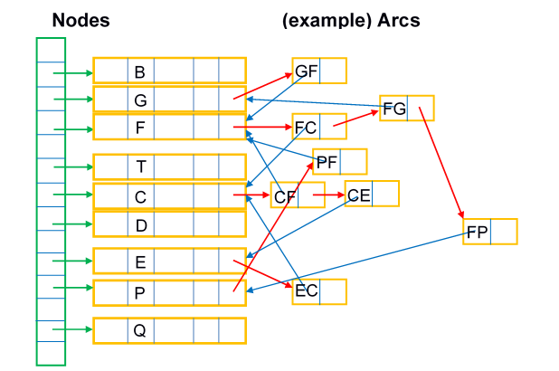

# Advanced Programming - Lab I (Final Lab)

The objective of this final lab is to implement, exercise and assess the performance of data structures that represent a transport network and support route-finding and evaluation.  A network is a collection of nodes and arcs so, in the context of a transport network the nodes will correspond to road/rail junctions; towns/cities/villages; bus/rail stations; air/sea ports, etc., while the network arcs will be road/rail route segments or air corridors/sea lanes as appropriate.

Data will be supplied (in formats as described below) for the nodes and arcs representing a transport network, together with a ‘command’ file specifying operations to be performed on the network data.  These operations may include, for example, reporting the distance between two nodes (places) on the network; finding neighbour nodes to a starting point; finding or validating a node sequence to form a journey between two places (pairs of nodes for origin and destination).  For each command type, a specific output format will be defined.  To streamline the assessment process, your software must implement all input and output formats precisely.

You will construct software in C++ with suitable class definitions for the necessary data structures, to input the supplied data and work through the commands. You will also be expected to present diagnostic data on process efficiency, for example the number of node/arc records visited in the data structure.

Performance is a key aspect of this Lab.  You will be expected not only to create a working solution, but a solution that executes quickly.  The marks allocated to the software are split equally between correctness and performance. 

## Provided Code and Files
Initial code has been provided and this **MUST** be used as a starting point for your implementation.

### Main.cpp
This file must **NOT** be edited. The `main.cpp` file will be replaced by a different `main.cpp` file during the marking process, along with different data files.  Therefore, any changes you make to your `main.cpp` file will be overwritten. Your software **MUST** work with the provided `main.cpp` file otherwise your code will not compile with the replacement `main.cpp` file.

### Utility

The `Utility` class contains a function called `LLtoUTM(...)`.  This function has been provided to convert latitude and longitude into x and y global coordinates.  It is recommended that you make use of this function when calculating distances.
Here is some example code (that is also in the `Navigation::BuildNetwork(...)` method) that shows how to use it.

```c++
// example code of using the LLtoUTM function from Utility to convert 
// latitude and longitude values into x and y global coordinates:
double latitude = 53.770, longitude = -0.368, x, y;
Utility::LLtoUTM(latitude, longitude, x, y);
```

### Commands.txt
The `Commands.txt` file is a file that you may edit.  This is a list of commands that your program is to execute.

### Navigation class
The provided Navigation class must **NOT** be renamed otherwise the replaced `main.cpp` file will not be able to find it.  You may, however, change the way the method parameters are passed (to satisfy Parasoft rules) but you must not change the type (i.e. string) – to reiterate **DO NOT** change any code inside of main.cpp.  Do **NOT** output to the ‘cout’ apart from at the end of your code.

The `BuildNetwork(...)` method will be used to:
1. Read in the network definition data (Places and Links files)
2. Construct your internal data structure(s). This method **MUST** return `true` if the build is successful (e.g. files have been correctly read) or `false` if the build is unsuccessful.  You **MUST** not change either the name or the parameters of this method.

The `ProcessCommand(...)` method is used to process each navigation command in turn. This method **MUST** return `true` if it processes the command successfully or `false` if it does not process the command successfully.  You **MUST** not change either the name or the parameters of this method.

The output file stream `_outFile` has already been created for you.  You **MUST** use this to output your results.  **DO NOT** change the output filename.

### Data 
Data is supplied in `csv` format (comma-separated variables) in two files: namely `Places.csv` and `Links.csv`.
Command formats are as described later in this document.

For the network Nodes (Places) file, each line of text will comprise a place name string (which may contain space(s)), followed by three numbers, being an integer reference code and two decimal numbers giving the location as a pair of coordinates for latitude and longitude in that conventional order.
For example, lines of the Places file might read:
```
Cottingham Rail,15931781,53.781,-0.407
Beverley Rail,15761842,53.842,-0.424
```

Data for each Arc (Link) will comprise two reference numbers for the nodes that the Arc joins, followed by a string giving the transport mode of the Arc.
For example, a line of the Links file that describes a Rail link between Cottingham Rail and Beverley Rail might read:
```
15931781,15761842,Rail
```

Transport Modes are Foot, Bike, Car, Bus, Rail, Ship.  When journeys are being investigated, only valid arcs may be considered according to the required mode and the following rules of hierarchy:
1.	a rail or ship journey may only use Arcs of the corresponding mode
2.	a bus journey may use bus, rail and ship Arcs
3.	a car journey may use car, bus and ship Arcs
4.	a bike journey may use bike Arcs and Arcs defined in 1 and 2
5.	a foot journey may use any Arc

These rules recognise for example that roadways generally have footpaths alongside (for the purposes of this exercise, motorways are excluded), and foot passengers may board all public transport modes.

---

### Data Structures
You must define suitable C++ classes to hold the network data, preferably using dynamic data structure techniques to build a single structure which will allow processes to follow Arcs (route segments) in sequence from a starting location towards and ultimately reaching a destination (see example diagram in fig 1).

The location data may be held in a linked list or an array of Node objects, with a suitable access mechanism so Nodes can be accessed according to their reference number.
Nodes should also allow for their name and their coordinates to be retrieved (their coordinates are provided as longitude and latitude, but you may want to store them as x and y global coordinates using the provided `LLtoUTM(...)` function)



**Fig 1. Example of a suitable dynamic network data structure**

Arc data should then be held in a manner which allows all the Arcs from a given Node (with their Mode type) to be accessed from that Node, and so that each Arc then gives access to the Node at its other end.
This will allow a journey finder/follower process to traverse the network smoothly by stepping along each consecutive Arc in turn from the origin Node to the destination Node.

Note that the input data will show each Arc only once, whereas routes may seek to traverse an Arc from either end, so your data structure should allow for this.

The diagram in fig 1 shows that Node F has Arcs to Nodes C, G and P, and vice-versa, plus Nodes C and E are linked.  These eight Arc objects would be built from only four data lines in the input data.

You may wish to calculate each Arc distance during your input process, and store it within the Arc object, based on the coordinates (x and y global coordinates) of the two place Nodes the Arc joins.  Alternatively, distances must be calculated when and if needed later during command processing.

---

### Processes, Commands and Output Format Definitions
The provided `BuildNetwork(...)` method will:
1.	Read in the network definition data (Places and Links files).
2.	Construct the internal data structure(s).
3.  This method **MUST** return `true` if the network build is successful or `false` if the network build is unsuccessful.

Each Command will be passed by the main method directly for processing using the provided `ProcessCommand(...)` method.
This method will:
1.	Invoke appropriate process code.
2.	Produce the required output of journey sequence(s) and performance diagnostic information (see below).
3.  This method **MUST** return `true` if it processes the command successfully or `false` if it does not process the command successfully.

The Commands will contain certain formats (notice white spaces rather than commas).
A list of Commands with example data can be found below.
For testing purposes, you should write your own example data.

Each Command should result in an output comprising:
1.	The text of the original command on one line; 
2.	Required output on subsequent line(s); 
3.	Followed by a single blank line.

All distance values will be outputted to **3 d.p.**

---

### MaxDist
Command **MaxDist** will find the furthest-separated places and calculate the distance between them.
It will output the starting place name, the end place name, and the direct distance between the two, followed by a blank line.

Example:
```
MaxDist 
```

Output:
```
MaxDist
York Rail,Rotterdam Harbour,416.543
 
```

---

### MaxLink 
Command **MaxLink** will find the longest single Arc (as two Node references).
It will output the starting place reference, the end place reference, and the direct distance between the two, followed by a blank line.

Example:
```
MaxLink 
```

Output:
```
MaxLink
17191741,61279944,358.402
 
```

---

### FindDist
Command **FindDist** will calculate the distance between specified places.
It will output the starting place name, the end place name, and the direct distance between the two, followed by a blank line.

Example:
```
FindDist 9361783 11391765
```

Output:
```
FindDist 9361783 11391765
Selby Rail,Howden Rail,13.531
 
```

---

### FindNeighbour 
Command **FindNeighbour** will list all neighbours of specified place.
It will output the references of all Nodes that are connected to a given Node, followed by a blank line.

Example:
```
FindNeighbour 8611522
```

Output:
```
FindNeighbour 8611522
9361783
11251704
12321385
13491586
 
```

---

### Check
Command **Check** will verify a proposed route between given places by the stated Mode (e.g. Rail, Car, etc.) over the given stage connections.

Example of the algorithm:
```
Check <mode> 14601225 12321385 8611522 9361783
```
1. Check valid route by the stated Mode from 14601225 to 12321385, i.e. first step of journey sequence
2. Then check valid route by the stated Mode from 12321385 to 8611522, i.e. stage step of journey sequence
3. Then check valid route by the stated Mode from 8611522 to 9361783, i.e. final step of journey sequence

Note that there may be any number of stage connections.

It will output the references as it verifies the proposed route between given places by the stated Mode (e.g. Rail, Car, etc.) over the given stage connections.
Each connection will be outputted as `PASS` is the connection is valid and `FAIL` if the connection is not valid.
The ouput will finish with a blank line.

If a `FAIL` is found then the process will stop.

Example of a correct route:
```
Check Rail 14601225 12321385 8611522 9361783
```

Output:
```
Check Rail 14601225 12321385 8611522 9361783
14601225,12321385,PASS
12321385,8611522,PASS
8611522,9361783,PASS
 
```

Example of an incorrect route:
```
Check Ship 14601225 12321385 8611522 9361783
```

Output:
```
Check Ship 14601225 12321385 8611522 9361783
14601225,12321385,FAIL
 
```

---

### FindRoute
Command **FindRoute** will find a journey sequence of Nodes between first (start) and destination (second) places by the stated Mode.
This can be any viable route, e.g. it could be the slowest route or the fastest route.
It will output the references of a route from the starting Node to the end Node by the stated Mode (e.g. Rail, Car, etc.), followed by a blank line.
If there is no valid route then output `FAIL`.

Example of a correct route:
```
FindRoute Rail 9081958 15832241
```

Output:
```
FindRoute Rail 9081958 15832241
9081958
12032132
15832241
 
```

Example of an incorrect route:
```
FindRoute Ship 9081958 15832241
```

Output:
```
FindRoute Ship 9081958 15832241
FAIL
 
```

---

### FindShortestRoute
Command **FindShortestRoute** will find the shortest journey sequence of Nodes between first (start) and destination (second) places by the stated Mode.
The shortest route is one defined as requiring the least number of nodes and not distance.

This command is similar to the command **FindRoute** but it is required to find only the shortest route in terms of number of nodes travelled.

It will output the references of a route from the starting Node to the end Node by the stated Mode (e.g. Rail, Car, etc.), followed by a blank line.
If there is no valid route then output `FAIL`.

Example of a correct route:
```
FindShortestRoute Rail 9081958 15832241
```
Output:
```
FindShortestRoute Rail 9081958 15832241
9081958
12032132
15832241
 
```

Example of an incorrect route:
```
FindShortestRoute Ship 9081958 15832241
```
Output:
```
FindShortestRoute Ship 9081958 15832241
FAIL
 
```

---

### Marking Scheme
A detailed marking scheme has been published.
This marking scheme will contain a breakdown of all of the marks and will give you the ability to mark yourself as you develop your software and write your lab book.

---

### Deliverables

#### Code
You are to submit all of your code to the module Canvas site.

**BEFORE** you submit your code, make sure that you:
 - Open your project in Visual Studio and then select `Build -> Clean Solution`.

#### Parasoft Results
Parasoft C++ Static Test results for your source code (in the form of an auto-generated HTML report)

#### Lab Book
Create a new chapter (Lab I) in your lab book (maximum 2000 words), which contains:
 - Design: Describe (with relevant diagrams) your data structures, and associated algorithms. 
 - Results: Provide timing results for the `BuildNetwork(...)` method and each Command as a row in a table.  Explain how these results were captured.

    | Command                  | Average Timing (ms) |
    | ------------------------ |---------------------|
    | BuildNetwork             | 2587                |
    | MaxDist                  | 56                  |
    | MaxLink                  | 956                 |
    | ...                      | ...                 |

 - Performance critique:  Explain the process you followed to improve performance.  Was it effective? Describe any changes you made to the data structure design or algorithms that improved performance.  What did you learn about C++ optimization. 